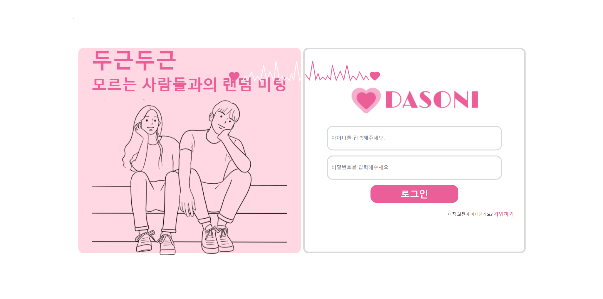

<h1 align="center", style="color: pink"> 👩👨 다소니 ❤ </h1>
 

<a href="http://i9a307.p.ssafy.io/">다소니</a>는 다대다 화상채팅 만남주선 서비스 입니다.

 

## 🔧 기술 스택

 

### Back-end & Front-end

### DataBase

### CI/CD & Infra Tools

### Collaboration Tools

### Issue & Configuration Management

 

## 0️⃣ 목차

### 1️⃣ 프로젝트 개요

- 🔹 팀 소개
- 🔹 프로젝트

### 2️⃣ 기획 & 설계

- 🔹 기획

  - 🔹 요구사항 정의서
  - 🔹 피그마

- 🔹 설계
  - 🔹 API 문서
  - 🔹 서비스 아키텍처
  - 🔹 ERD

### 3️⃣ 핵심 기능

- 🔹 실시간 매칭
- 🔹 다대다 화상 미팅
- 🔹 레이팅 시스템

### 4️⃣ 협업 & 팀 컨벤션

- 🔹 Commit Convention
- 🔹 Git Flow
- 🔹 Team Rule & Culture

### 5️⃣ 🚨 트러블 슈팅 🚨

- [x] [SSE와 비동기 처리](https://github.com/YeryunJung)
- [x] [매칭 알고리즘 구조 개선](https://github.com/Fishphobiagg)
- [x] [리덕스 스토어 새로고침 상태유지](https://github.com/minaldo15)
- [x] [WebSocket과 STOMP, SSE 비동기 처리](https://velog.io/@27kanghan/WebSocket-STOMP-React%EB%A5%BC-%ED%99%9C%EC%9A%A9%ED%95%9C-%ED%94%84%EB%A1%9C%EC%A0%9D%ED%8A%B8-%EC%A4%91-%ED%8A%B8%EB%9F%AC%EB%B8%94-%EC%8A%88%ED%8C%85)
- [x] [커스텀 훅으로 웹 소켓 연결 중복 코드 제거, 비동기 상태 설정으로 Stomp client 에러 해결](https://sunsunny.tistory.com/93)

 

<h1 align="center"> 프로젝트 개요 </h1>
 

<h3 align="center">로그인 화면</h3>
 

## 👋 팀 소개

 

| **강한(팀장**)                                    | **이명우**                                        | **권현우**                                                    | **김유진**                                        | **김선희**                                      | **민경현**                                        |
| ------------------------------------------------- | ------------------------------------------------- | ------------------------------------------------------------- | ------------------------------------------------- | ----------------------------------------------- | ------------------------------------------------- |
| 
Backend
 | 
Backend
 | 
Backend   DevOps
 | 
Backend
 | 
Frontend
 | 
Frontend
   |
| WebSocket   채팅,매칭,알람 서비스              | 매칭, 레이팅 알고리즘   REST API               | CI/CD   프로필 사진 API                                    |                                                   |  WebSocket 대기방, 미팅 시스템   WebRTC   UX / UI                              | 회원가입 및 로그인   모달 및 컴포넌트   CSS |
| [@27kanghan](https://github.com/27kanghan)        | [@Fishphobiagg](https://github.com/Fishphobiagg)  | [@mycodeisnoob](https://github.com/mycodeisnoob)              | [@Yujin830](https://github.com/Yujin830)          | [@KimSeonHui](https://github.com/KimSeonHui)    | [@minaldo15](https://github.com/minaldo15)        |

 

## 🍳 프로젝트

 

<h1 align="center"> 기획 & 설계 </h1>

프로젝트 기획 및 설계 문서들입니다

## 🖋 기획

### 📃 [요구사항 정의서](https://plump-sailor-daa.notion.site/4d2fb2d9fa3049e6a0689b2c40d1cd52?pvs=4)

### 🎨 [피그마](https://www.figma.com/file/lMRXAT3HPBflT8HtT5Z20T/%EC%8B%9C%EA%B7%B8%EB%8B%88%EC%97%98?type=design&node-id=102%3A567&mode=design&t=cq2dlHwKx8UW5FVs-1)

## 🛠 설계

### 📕 [API 문서](https://plump-sailor-daa.notion.site/API-57a6d9c4a1f24f96bcd6625c08a53d73?pvs=4)

### 💿 [ERD](/img/ERD.png)

### 📁 [서비스 아키텍처](/img/Tech.png)

 

<h1 align="center"> 핵심 기능 </h1>

## 실시간 매칭

## N대N 화상 미팅

 

<h1 align="center"> 협업 & 팀 컨벤션 </h1>

## 팀 컨벤션

### 브랜치 전략 : git-flow 사용

###

## 협업

 

<h1 align="center"> 트러블 슈팅 </h1>
